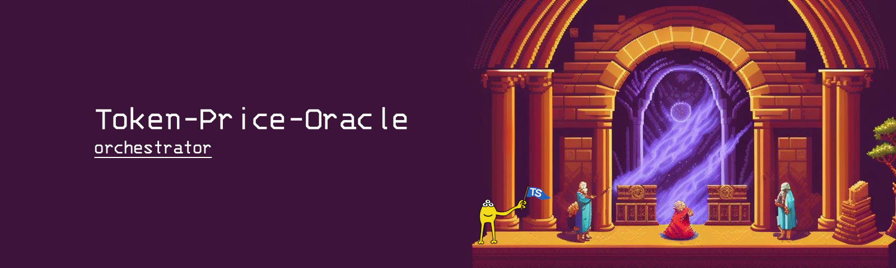
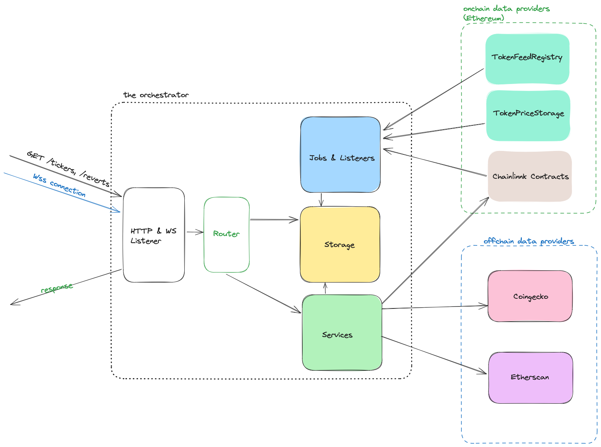

# Token Price Oracle - Orchestrator 🎶
Token Price Oracle is simple oracle for tracking token prices on-chain.
In this repo is located the Typescript Client orchestrator used for
tracking, management and orchestration of the data.



## Documentation 📚
You'll find the API specification under `/docs/api` and you can also run
interactive Swagger client by running the project and going to the `/api-docs` route in your browser.  
_Example: http://localhost:3001/api-docs_

The main site for documentation is located on the [link here](https://despotf.gitbook.io/token-price-oracle/).

## Running the project 🚀
### Requirements ✅
- On your computer
  * If setting up using Docker
    * Installed [Docker](https://www.docker.com/)
    * Installed docker-compose (Bundled with the official Docker setup)
  * If setting up locally
    * Installed [Node.js 18](https://nodejs.org/en/)
    * Installed [yarn](https://yarnpkg.com/) package manager
    
### Installation ⚙️
#### Git
1. Clone the repo: ```git clone https://github.com/pajicf/token-price-oracle-orchestrator.git```
2. Navigate to the folder: ```cd token-price-oracle-orchestrator```

#### Setting up the environment
3. Run ```cp .env.example .env``` and fill the values`  

**Where can I obtain the needed values?**

| Value             | Description                                                                                                   | Link                                      |
|------------------|---------------------------------------------------------------------------------------------------------------|--------------------------------------------------|
| COINGECKO_API_KEY  | The API key for consuming Coingecko service                                                                   | https://www.coingecko.com/en/api/pricing               |
| ETHERSCAN_API_KEY  | The API key for consuming Etherscan service                                                                   | https://docs.etherscan.io/getting-started/viewing-api-usage-statistics               |
| ALCHEMY_URL  | Url for interacting with Alchemy (Make sure the Network is the same as of other values)                       | https://docs.alchemy.com/docs/alchemy-quickstart-guide              |
| PRIVATE_KEY  | The Private key that your orchestrator instance will be using for interacting with the EVM compatible network | https://support.metamask.io/hc/en-us/articles/360015289632-How-to-export-an-account-s-private-key  |

> [!IMPORTANT]  
> Ensure that you've filled all the needed values in the .env

---
After you complete the previous steps, the following instruction will vary based on that
if you're trying to run the project using docker or your local setup
---

#### Docker setup
4. Run `docker-compose up`
5. That's it!
> [!NOTE]
> If you've pulled new code files you'll have to rebuild the Docker image using `docker-compose build --no-cache token_price_oracle_orchestrator_ts`

#### Running locally
4. Run ```yarn``` to install the dependencies
5. Building the project: ```yarn build```
6. Starting the project: ```yarn start```

### Commands 🧑‍💻
| Name             | Command          | Description                                      |
|------------------|------------------|--------------------------------------------------|
| Dev Environment  | ```yarn dev```   | Starts the development environment               |
| Build            | ```yarn build``` | Compiles the project and builds production files |
| Start            | ```yarn start``` | Starts the project from the production build     |
| Contract Typings | ```yarn lint```  | Lints the project using `eslint`                 |